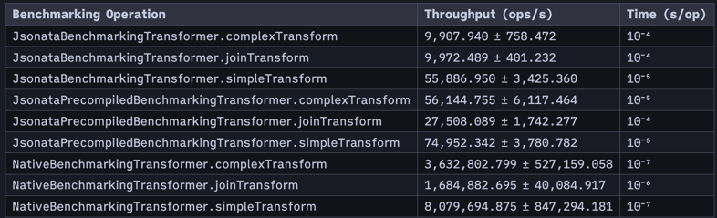

# jsonata4java-benchmark

Minimal Benchmarking of [IBM JSONata4Java](https://github.com/IBM/JSONata4Java) vs doing the same
work in native Java.

This benchmark is implemented
using [Java Microbenchmark Harness (JMH)](https://github.com/openjdk/jmh)

## Latest Run (2023-12-11T20:00:49Z IST) Results

### Test ran

The aim was to calculate the average operation time and throughput.

- Ran three types of transformations (SIMPLE / COMPLEX / JOIN)
- Ran using 1 JVM Warmup Process and 2 Evaluated JVM Processes
- Each process runs 3 Warmup iterations and 5 Evaluated iterations
- Each iteration runs as many operations as possible for 5 seconds

### Key Findings

As per the benchmarking results,

1. logic implemented natively in Java is between 2 and 3 orders of magnitude faster than
   the same logic implemented in JSONata.
2. JSONata precompiled implementation is up to 1 order of magnitude faster than the
   compiled-at-runtime JSONata implementation.
3. JSONata implementation code is much more repeatable and flexible than the native
   implementation.

### Summary

Despite JSONata seeming much slower than native implementation, most systems are not going to be
doing this order of magnitude of processing anyway. So, the JSONata implementation is a good choice
for most systems, because of its flexibility.
